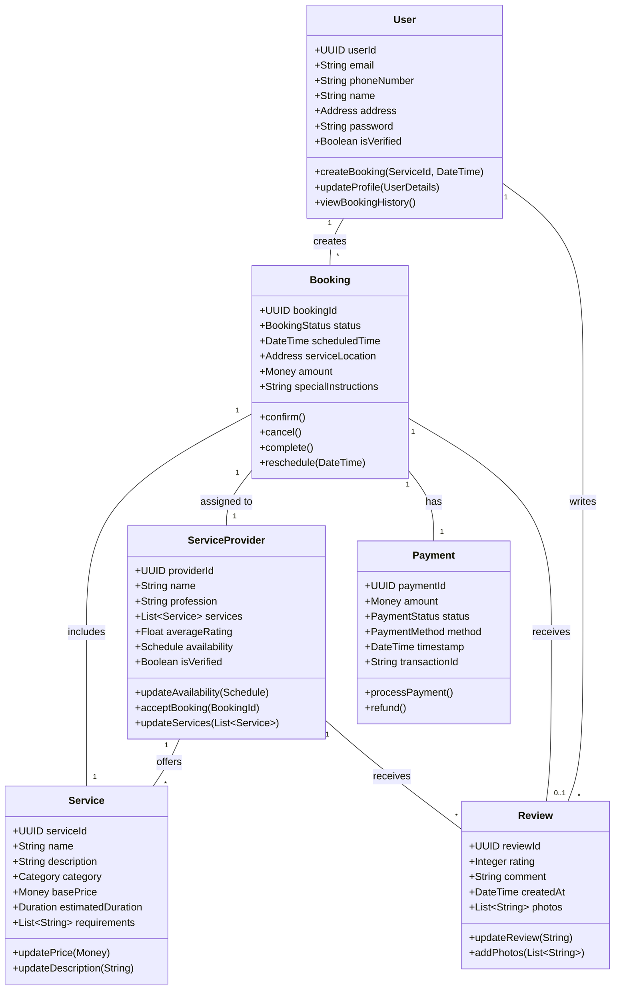

# ServiceSync

## Project Description

ServiceSync is a platform for finding skilled service providers to handle all your at-home service needs.Whether you’re looking for a trusted cleaner, a beautician, a plumber or an electrician, ServiceSync makes it easy to find reliable service providers who are ready to help.
ServiceSync is designed with both customers and service providers in mind. For customers, it’s a simple and efficient way to book services from the comfort of their homes. Just browse, book, and let the service providers come to you. For service providers, it’s a powerful tool to expand their reach and a mean for additional income. They can list services, set availability, and manage bookings all in one user friendly platform.

<i>With ServiceSync, we are not just connecting people we are also building a trusted community where quality service is just a few clicks away.</i>

## Team Members

Keerthi Anil (anil.ke@northeastern.edu)<br>
Kavya Pratik Mehta (mehta.kavy@northeastern.edu) <br>
Riya Shital Patel (patel.riyas@northeastern.edu)<br>
Yeshwanth Balaji (balaji.y@northeastern.edu)<br>

## Object Model using Domain Driven Design



## Milestones

## Milestone 1: User Management

- As a user, I can create an account with email/phone verification
- As a user, I can log in securely
- As a user, I can update my profile and address
- As a user, I can view my booking history

## Milestone 2: Service Provider Management

- As a service provider, I can register on the platform
- As a provider, I can list my services with prices
- As a provider, I can set my availability schedule
- As a provider, I can update my service offerings

## Milestone 3: Service Management

- As a user, I can view a list of all available services.
- As a user, I can filter services by category, price range, and location.
- As a provider, I can assign my services to specific categories.
- As a provider, I can add descriptions, images, and prices for each service.
- As a provider, I can update the details of my existing services.
- As a user, I can view details of a specific service, including description, pricing, and provider information.

## Milestone 4: Booking Management

- As a user, I can search for services by category
- As a user, I can view service provider profiles and ratings
- As a user, I can book a service for a specific time
- As a user, I can track the status of my booking

## Milestone 5: Payment

- As a user, I can make secure payments for services
- As a user, I can rate and review service providers
- As a provider, I can receive payments through the platform

## Milestone 6: Reviews

- As a user, I can view provider ratings and reviews
- As a user, I can give ratings and reviews to the provider
- As a provider, I can view user ratings and reviews

---
### Running the Project: Step-by-Step Instructions

#### Prerequisites
1. **Node.js**: Ensure Node.js (version 14.x or later) is installed on your system. You can download it from [Node.js official website](https://nodejs.org/).
2. **MongoDB**: You need MongoDB (version 4.x or later) installed locally or have an account on MongoDB Atlas for a cloud database. Download or setup MongoDB from [MongoDB's site](https://www.mongodb.com/try/download/community).

#### Backend Setup

1. **Clone the Repository**
   Clone the ServiceSync repository from GitHub:
   ```bash
   git clone <URL_TO_YOUR_GITHUB_REPOSITORY>
   cd ServiceSync
   ```

2. **Navigate to the Backend Directory**
   ```bash
   cd backend
   ```

3. **Install Dependencies**
   Install all required npm packages:
   ```bash
   npm install
   ```

4. **Set Up Environment Variables**
   Create a `.env` file in the backend directory and specify the MongoDB URI and other environment variables:
   ```plaintext
   DB_URI=mongodb://localhost:27017/servicesync  # Replace with your MongoDB connection string
   JWT_SECRET=your_secret_key
   PORT=5000
   ```

5. **Start the Backend Server**
   Run the following command to start the server:
   ```bash
   npm start
   ```
   The backend should now be running on `http://localhost:5000`.

#### Frontend Setup (React with Vite)

1. **Navigate to the Frontend Directory**
   Open a new terminal and go to the frontend directory:
   ```bash
   cd frontend
   ```

2. **Install Dependencies**
   Install npm packages required by the frontend:
   ```bash
   npm install
   ```

3. **Run the React Application**
   Start the Vite server:
   ```bash
   npm run dev
   ```
   This will start the frontend development server, typically available at `http://localhost:3000`.

#### Interacting with the API via Postman

1. **Open Postman**: If you haven't already, download and install Postman from [Postman's website](https://www.postman.com/downloads/).

2. **Set Up Requests**: Configure Postman to send requests to the backend. Use the base URL (`http://localhost:5000`) and append the appropriate endpoints. For example, to access a service endpoint:
   ```plaintext
   GET http://localhost:5000/api/services
   ```

3. **Send Requests**: You can now use Postman to test your backend API by sending different HTTP requests (GET, POST, PUT, DELETE) to see how your API handles them.

